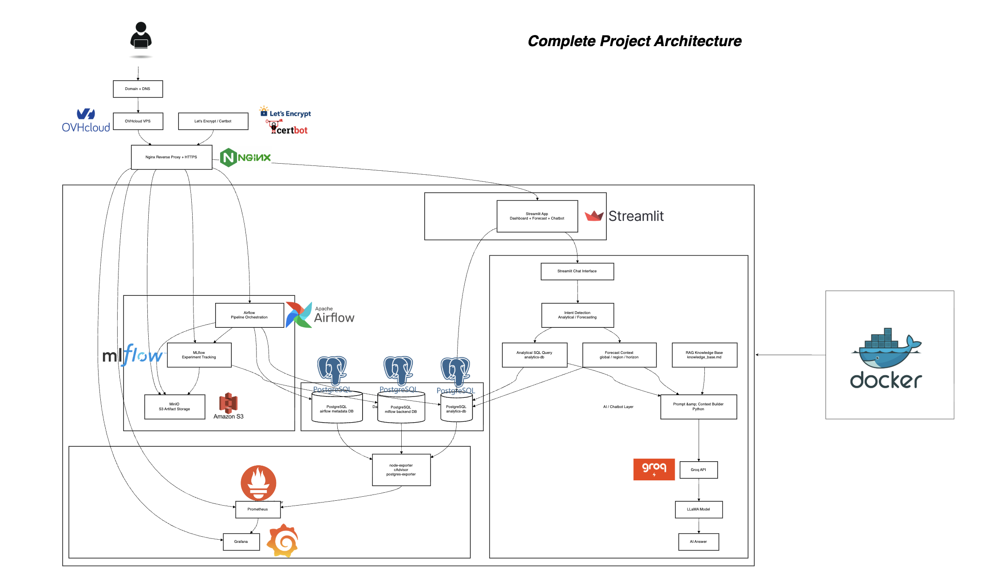
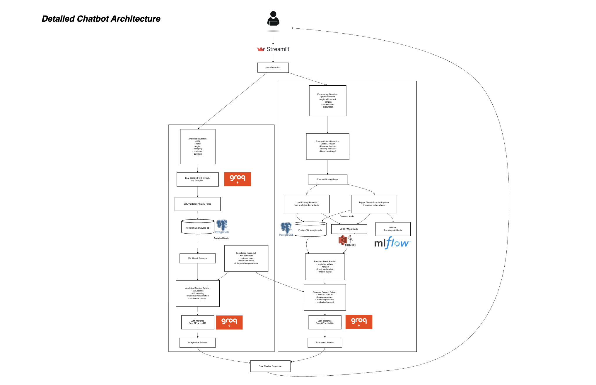

# 🛒 Retail Sales Forecast Platform

Plateforme de prévision des ventes e-commerce de bout en bout intégrant pipelines data et modèles de séries temporelles, orchestrés avec Airflow, suivis via MLflow, stockés sur S3 (MinIO), exposés via une application Streamlit et supervisés avec Prometheus et Grafana.

---

## 📝 Contexte Métier

Dans un contexte e-commerce, la capacité à anticiper les ventes futures est un levier stratégique majeur pour :

1. Optimiser la gestion des stocks
2. Améliorer la planification logistique
3. Ajuster les stratégies marketing et promotionnelles
4. Maximiser le chiffre d'affaires tout en réduisant les coûts opérationnels

Les ventes e-commerce sont influencées par de nombreux facteurs : saisonnalité, comportements clients, types de produits, modes de paiement, localisation géographique, et conditions de livraison.

---

## 🎯 Objectifs

L'objectif du projet est de concevoir une plateforme complète de prévision des ventes e-commerce permettant de :

1. **Automatiser les pipelines data et machine learning** pour la préparation des données et l'entraînement des modèles de séries temporelles
2. **Prédire les ventes futures** à différentes granularités temporelles (journalière, hebdomadaire, mensuelle)
3. **Suivre et gérer les expériences des modèles** grâce à MLflow (tracking, modèles et artefacts)
4. **Fournir des indicateurs clairs et interprétables** pour faciliter la prise de décision métier
5. **Rendre les résultats accessibles via une application interactive** développée avec Streamlit
6. **Superviser l'infrastructure et les pipelines** grâce à une stack de monitoring Prometheus et Grafana

---

## 🔎 Vue D'ensemble

Le projet couvre toute la chaîne de valeur :

- Ingestion et préparation des données transactionnelles e-commerce
- Entraînement de modèles ML globaux et régionaux
- Entraînement de modèles time series par région
- Serving interactif via Streamlit (dashboard + prévision + chatbot data)
- Orchestration des workflows avec Airflow
- Tracking des expériences et artefacts avec MLflow + S3 (MinIO)
- Observabilité système et applicative avec Prometheus + Grafana

---

## 🛠️ Technologies Utilisées

### Analyse et Traitement de Données
- **pandas** - Manipulation de données
- **numpy** - Calculs numériques

### Visualisation
- **matplotlib** - Graphiques statiques
- **seaborn** - Visualisations statistiques
- **plotly** - Graphiques interactifs

### Machine Learning
- **scikit-learn** (v1.5.0) - Modèles ML classiques
- **Histogram Gradient Boosting** - Histogram Gradient Boosting 
- **statsmodels** - Modèles statistiques (SARIMAX) et Holt-Winters
- **prophet** - Prévisions de séries temporelles

### LLM

- **LLM inference :** Groq API
- **LLM model :** LLaMA 3.3 70B
- **RAG orchestration :** Python
- **Prompt engineering :** contextual prompts + data summaries
- **Data source :** PostgreSQL analytics database

### Utilitaires
- **joblib** - Sérialisation de modèles
- **python-dotenv** - Gestion des variables d'environnement

### Core Services
- **Streamlit** - Interface utilisateur
- **Airflow** - Orchestration des pipelines data
- **MLflow** - Suivi des expériences et registre des modèles
- **S3 (MinIO)** - Stockage des artefacts
- **Prometheus + Grafana** - Monitoring
- **Nginx** - Reverse proxy et terminaison HTTPS
- **Let's Encrypt & Certbot** - Génération et renouvellement automatique des certificats SSL

### Data and Metadata Layer
- **PostgreSQL (analytics DB)** - Stocke les données prêtes à être analysées
- **PostgreSQL (Airflow metadata DB)** - Stocke les exécutions DAG, états des tâches et métadonnées du scheduler
- **PostgreSQL (MLflow backend DB)** - Stocke les métadonnées des expériences, exécutions et informations de suivi

### Monitoring Layer
- **node-exporter** - Métriques au niveau du VPS / hôte
- **cAdvisor** - Métriques des conteneurs Docker
- **postgres-exporter** - Métriques PostgreSQL
- **Prometheus** - Collecte des métriques
- **Grafana** - Tableaux de bord et visualisation

### Infrastructure Layer
- **Docker Compose** - Orchestration des services
- **OVHcloud VPS** - Infrastructure cloud hébergeant la plateforme
- **Nginx** - Point d'entrée public et terminaison HTTPS
- **Let's Encrypt & Certbot** - Génération et renouvellement automatique des certificats SSL

---

## Architecture Diagram




---

## 💡 Fonctionnalités Applicatives (Streamlit)

- **📊 Dashboard** - KPIs, courbes temporelles, analyses région / catégorie / paiement / client
- **🔮 Prévision** - Forecast global et par région
- **💬 Chatbot** - Interface conversationnelle pour interroger les données de manière analytique et prévisionnelle

---

## 📊 Dataset

**Jeux de données sources (`data/raw/`) :**
- **df_Orders.csv** - Commandes avec statuts et dates
- **df_OrderItems.csv** - Détails des articles commandés
- **df_Customers.csv** - Informations clients
- **df_Payments.csv** - Modes et montants de paiement
- **df_Products.csv** - Catalogue de produits

**Zones de travail :**
- **data/raw/** - Données brutes
- **data/interim/** - Données nettoyées / fusionnées / features intermédiaires
- **data/processed/** - Données prêtes pour l'entraînement

---

## 🚀 Installation Locale

### Prérequis

- Python 3.10 à 3.12
- pip ou uv pour la gestion des dépendances

### Configuration des variables d'environnement

Copiez le fichier **.env.example** vers **.env** et renseignez les valeurs :

```bash
cp .env.example .env
```

- **GROQ_API_KEY =** "gsk_..."
- **GROQ_MODEL =** "..."
- **ANALYTICS_DATABASE_URL =** "..."

### Installation

```bash
# Cloner le repository
git remote add origin https://github.com/Cedric-LEBE/Retail-Sales-Forecasts.git
cd Retail-Sales-Forecasts

# Créer et activer un environnement virtuel
python3 -m venv .venv

# Sur Linux/Mac :
source .venv/bin/activate

# Sur Windows :
.venv\Scripts\activate

# Installer les dépendances
pip install -e ".[prophet]"

# Lancer l'application Streamlit
python scripts/run_all.py
python scripts/sanity_check.py
streamlit run app/app.py

# Lancement de la stack complète
docker compose up -d --build
```

---

## 📁 Structure Du Projet

```text
.
|-- airflow/
|-- app/
|-- data/
|-- fil_rouge/
|-- mlflow/
|-- minio/
|-- monitoring/
|-- nginx/
|-- scripts/
|-- docker-compose.yml
|-- pyproject.toml
`-- README.md
```

---

## 🖇 Scripts Utiles

- **scripts/make_dataset.py** - Préparation des données
- **scripts/train_ml_global.py** - Entraînement modèle global
- **scripts/train_ml_region.py** - Entraînement modèle régional
- **scripts/train_ts_region.py** - Entraînement TS par région
- **scripts/run_all.py** - Pipeline complet data + ML + TS
- **scripts/sanity_check.py** - Vérification des artefacts minimaux
- **scripts/load_analytics_db.py** - Chargement de la base analytique

---

## 🌐 Accès Déploiement

| Service | URL |
|---|---|
| Application principale |🔗 https://retail.sales-forecasts.com |
| Airflow |🔗 https://retail.sales-forecasts.com/airflow/ |
| MLflow |🔗 https://retail.sales-forecasts.com/mlflow/ |
| MinIO Console |🔗 https://minio.sales-forecasts.com |
| Prometheus |🔗 https://retail.sales-forecasts.com/prometheus/ |
| Grafana |🔗 https://retail.sales-forecasts.com/grafana/ |

**Identifiants par défaut** (services web, hors Streamlit) :
- **User :** `guest`
- **Password :** `Guest2026!`

> **Note :** MLflow et Prometheus sont protégés par authentification HTTP Basic via Nginx. Tous les services exposés en public sont en HTTPS avec certificats TLS Let's Encrypt (Certbot).

---

## 📦 Stack

- **Programming & ML :** Python (pandas, numpy, scikit-learn, xgboost, statsmodels, prophet, Holt-Winters)
- **Configuration management :** python-dotenv
- **Serialization :** joblib
- **LLM inference :** Groq API
- **LLM model :** LLaMA 3.3 70B
- **App Layer :** Streamlit
- **Orchestration :** Apache Airflow
- **Experiment Tracking :** MLflow
- **Object Storage :** MinIO (S3-compatible)
- **Databases :** PostgreSQL
- **Monitoring :** Prometheus, Grafana, node-exporter, cAdvisor, postgres-exporter
- **Infrastructure :** Docker, Docker Compose, Nginx
- **Security :** HTTPS, Basic Auth
